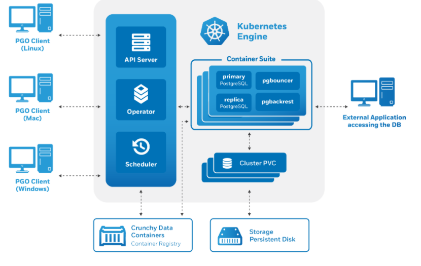

<h1 align="center">Crunchy Data PostgreSQL Operator</h1>

The [Crunchy PostgreSQL Operator][documentation] automates and simplifies deploying and managing
open source PostgreSQL clusters on Kubernetes and other Kubernetes-enabled Platforms by providing
the essential features you need to keep your PostgreSQL clusters up and running.

### Operator's features are as follows:

- **PostgreSQL Cluster [Provisioning][provisioning] :**

[Create, Scale, & Delete PostgreSQL clusters with ease][provisioning], while fully customizing your
Pods and PostgreSQL configuration!

- **[High Availability][high-availability] :**

Safe, automated failover backed by a [distributed consensus based high-availability solution][high-availability].
Uses [Pod Anti-Affinity][k8s-anti-affinity] to help resiliency; you can configure how aggressive this can be!
Failed primaries automatically heal, allowing for faster recovery time.

Support for [standby PostgreSQL clusters][multiple-cluster] that work both within and across [multiple Kubernetes clusters][multiple-cluster].

- **[Disaster Recovery][disaster-recovery]:**

Backups and restores leverage the open source [pgBackRest][] utility and
[includes support for full, incremental, and differential backups as well as efficient delta restores][disaster-recovery].
Set how long you want your backups retained for. Works great with very large databases!

- **TLS :**

Secure communication between your applications and data servers by [enabling TLS for your PostgreSQL servers][pgo-task-tls],
including the ability to enforce that all of your connections to use TLS.

- **[Monitoring][monitoring]:**

[Track the health of your PostgreSQL clusters][monitoring] using the open source [pgMonitor][] library.

- **PostgreSQL User Management:**

Quickly add and remove users from your PostgreSQL clusters with powerful commands. Manage password
expiration policies or use your preferred PostgreSQL authentication scheme.

- **Upgrade Management:**

Safely apply PostgreSQL updates with minimal availability impact to your PostgreSQL clusters.

- **Advanced Replication Support:**

Choose between [asynchronous replication][high-availability] and [synchronous replication][high-availability-sync]
for workloads that are sensitive to losing transactions.

- **Clone:**

Create new clusters from your existing clusters or backups with [`pgo create cluster --restore-from`][pgo-create-cluster].

- **Connection Pooling:**

Use [pgBouncer][] for connection pooling

- **Node Affinity:**

Have your PostgreSQL clusters deployed to [Kubernetes Nodes][k8s-nodes] of your preference

- **Scheduled Backups:**

Choose the type of backup (full, incremental, differential) and [how frequently you want it to occur][disaster-recovery-scheduling] on each PostgreSQL cluster.

- **Backup to S3:**

[Store your backups in Amazon S3][disaster-recovery-s3] or any object storage system that supports
the S3 protocol. The PostgreSQL Operator can backup, restore, and create new clusters from these backups.

- **Multi-Namespace Support:**

You can control how the PostgreSQL Operator leverages [Kubernetes Namespaces][k8s-namespaces] with several different deployment models:

  1.Deploy the PostgreSQL Operator and all PostgreSQL clusters to the same namespace

  2.Deploy the PostgreSQL Operator to one namespaces, and all PostgreSQL clusters to a different namespace

  3.Deploy the PostgreSQL Operator to one namespace, and have your PostgreSQL clusters managed across multiple namespaces

  4.Dynamically add and remove namespaces managed by the PostgreSQL Operator using the `pgo create namespace` and `pgo delete namespace` commands

- **Full Customizability:**

The Crunchy PostgreSQL Operator makes it easy to get your own PostgreSQL-as-a-Service up and running on Kubernetes-enabled platforms, but we know that there are further customizations that you can make. As such, the Crunchy PostgreSQL Operator allows you to further customize your deployments, including:

  1.Selecting different storage classes for your primary, replica, and backup storage

  2.Select your own container resources class for each PostgreSQL cluster deployment; differentiate between resources applied for primary and replica clusters!

  3.Use your own container image repository, including support `imagePullSecrets` and private repositories

  4.[Customize your PostgreSQL configuration](https://access.crunchydata.com/documentation/postgres-operator/latest/advanced/custom-configuration/)

  5.Bring your own trusted certificate authority (CA) for use with the Operator API server

  6.Override your PostgreSQL configuration for each cluster

[disaster-recovery]: https://access.crunchydata.com/documentation/postgres-operator/latest/architecture/disaster-recovery/
[disaster-recovery-s3]: https://access.crunchydata.com/documentation/postgres-operator/latest/architecture/disaster-recovery/#using-s3
[disaster-recovery-scheduling]: https://access.crunchydata.com/documentation/postgres-operator/latest/architecture/disaster-recovery/#scheduling-backups
[high-availability]: https://access.crunchydata.com/documentation/postgres-operator/latest/architecture/high-availability/
[high-availability-sync]: https://access.crunchydata.com/documentation/postgres-operator/latest/architecture/high-availability/#synchronous-replication-guarding-against-transactions-loss
[monitoring]: https://access.crunchydata.com/documentation/postgres-operator/latest/architecture/monitoring/
[multiple-cluster]: https://access.crunchydata.com/documentation/postgres-operator/latest/architecture/high-availability/multi-cluster-kubernetes/
[pgo-create-cluster]: https://access.crunchydata.com/documentation/postgres-operator/latest/pgo-client/reference/pgo_create_cluster/
[pgo-task-tls]: https://access.crunchydata.com/documentation/postgres-operator/latest/pgo-client/common-tasks/#enable-tls
[provisioning]: https://access.crunchydata.com/documentation/postgres-operator/latest/architecture/provisioning/

[k8s-anti-affinity]: https://kubernetes.io/docs/concepts/configuration/assign-pod-node/#inter-pod-affinity-and-anti-affinity
[k8s-namespaces]: https://kubernetes.io/docs/concepts/overview/working-with-objects/namespaces/
[k8s-nodes]: https://kubernetes.io/docs/concepts/architecture/nodes/

[pgBackRest]: https://www.pgbackrest.org
[pgBouncer]: https://access.crunchydata.com/documentation/pgbouncer/
[pgMonitor]: https://github.com/CrunchyData/pgmonitor

### Deployment Requirements :

The PostgreSQL Operator is validated for deployment on Kubernetes, OpenShift, and VMware Enterprise PKS clusters.  Some form of storage is required like NFS, hostPath, and Storage Classes are currently supported.

### Architecture : 

The PostgreSQL Operator includes various components that get deployed to your
Kubernetes cluster as shown in the following diagram and detailed
in the Design section of the documentation for the version you are running.

The PostgreSQL Operator is developed and tested on CentOS and RHEL Linux platforms but is known to run on other Linux variants.

### Supported Platforms:

The Crunchy PostgreSQL Operator is tested on the following Platforms:

- Kubernetes 1.13+
- OpenShift 3.11+
- Google Kubernetes Engine (GKE), including Anthos
- Amazon EKS
- VMware Enterprise PKS 1.3+

### Storage:

The Crunchy PostgreSQL Operator is tested with a variety of different types of Kubernetes storage and Storage Classes, including:

- Google Compute Engine persistent volumes
- HostPath
- NFS
- Rook
- StorageOS

and more.

Installations methods include:

- [Quickstart](https://access.crunchydata.com/documentation/postgres-operator/latest/quickstart/)
- [PostgreSQL Operator Installer](https://access.crunchydata.com/documentation/postgres-operator/latest/installation/postgres-operator/)
- [Ansible](https://access.crunchydata.com/documentation/postgres-operator/latest/installation/other/ansible/)
- [OperatorHub](https://operatorhub.io/operator/postgresql)
- [Developer Installation](https://access.crunchydata.com/documentation/postgres-operator/latest/installation/other/bash/)

### `pgo` Client Installation: 

If you have the PostgreSQL Operator installed in your environment, and are interested in installation of the client interface, please start here:

- [pgo Client Install](https://access.crunchydata.com/documentation/postgres-operator/latest/installation/pgo-client/)

There is also a `pgo-client` container if you wish to deploy the client directly to your Kubernetes environment.

### Included Components: 

[PostgreSQL containers](https://github.com/CrunchyData/crunchy-containers) deployed with the PostgreSQL Operator include the following components:

- [PostgreSQL](https://www.postgresql.org)
  - [PostgreSQL Contrib Modules](https://www.postgresql.org/docs/current/contrib.html)
  - [PL/Python + PL/Python 3](https://www.postgresql.org/docs/current/plpython.html)
  - [pgAudit](https://www.pgaudit.org/)
  - [pgAudit Analyze](https://github.com/pgaudit/pgaudit_analyze)
  - [pgnodemx](https://github.com/CrunchyData/pgnodemx)
  - [set_user](https://github.com/pgaudit/set_user)
  - [wal2json](https://github.com/eulerto/wal2json)
- [pgBackRest](https://pgbackrest.org/)
- [pgBouncer](http://pgbouncer.github.io/)
- [pgAdmin 4](https://www.pgadmin.org/)
- [pgMonitor](https://github.com/CrunchyData/pgmonitor)
- [Patroni](https://patroni.readthedocs.io/)
- [LLVM](https://llvm.org/) (for [JIT compilation](https://www.postgresql.org/docs/current/jit.html))

In addition to the above, the geospatially enhanced PostgreSQL + PostGIS container adds the following components:

- [PostGIS](http://postgis.net/)
- [pgRouting](https://pgrouting.org/)
- [PL/R](https://github.com/postgres-plr/plr)

[PostgreSQL Operator Monitoring](https://crunchydata.github.io/postgres-operator/latest/architecture/monitoring/) uses the following components:

- [pgMonitor](https://github.com/CrunchyData/pgmonitor)
- [Prometheus](https://github.com/prometheus/prometheus)
- [Grafana](https://github.com/grafana/grafana)
- [Alertmanager](https://github.com/prometheus/alertmanager)

Additional containers that are not directly integrated with the PostgreSQL Operator but can work alongside it include:

- [pgPool II](https://access.crunchydata.com/documentation/crunchy-postgres-containers/latest/container-specifications/crunchy-pgpool/)
- [pg_upgrade](https://access.crunchydata.com/documentation/crunchy-postgres-containers/latest/container-specifications/crunchy-upgrade/)
- [pgBench](https://access.crunchydata.com/documentation/crunchy-postgres-containers/latest/container-specifications/crunchy-pgbench/)

For more information about which versions of the PostgreSQL Operator include which components, please visit the [compatibility](https://access.crunchydata.com/documentation/postgres-operator/latest/configuration/compatibility/) section of the documentation.

### Using the PostgreSQL Operator

If you are new to the PostgreSQL Operator, you can follow along the [tutorial](https://access.crunchydata.com/documentation/postgres-operator/latest/tutorial/) to learn how to install the PostgreSQL Operator and how to use many of its features!

- [PostgreSQL Operator Tutorial](https://access.crunchydata.com/documentation/postgres-operator/latest/tutorial/)

If you have the PostgreSQL and Client Interface installed in your environment and are interested in guidance on the use of the Crunchy PostgreSQL Operator, please start here:

- [PostgreSQL Operator Documentation](https://access.crunchydata.com/documentation/postgres-operator/)
- [`pgo` Client User Guide](https://access.crunchydata.com/documentation/postgres-operator/latest/pgo-client/)

### Documentation:

For additional information regarding design, configuration and operation of the
PostgreSQL Operator, pleases see the [Official Project Documentation][documentation].

If you are looking for the [nightly builds of the documentation](https://crunchydata.github.io/postgres-operator/latest/), you can view them at:

https://crunchydata.github.io/postgres-operator/latest/

[documentation]: https://access.crunchydata.com/documentation/postgres-operator/

### Releases:

When a PostgreSQL Operator general availability (GA) release occurs, the container images are distributed on the following platforms in order:

- [Crunchy Data Customer Portal](https://access.crunchydata.com/)
- [Crunchy Data Developer Portal](https://www.crunchydata.com/developers)
- [DockerHub](https://hub.docker.com/u/crunchydata)

The image rollout can occur over the course of several days.

To stay up-to-date on when releases are made available in the [Crunchy Data Developer Portal](https://www.crunchydata.com/developers), please sign up for the [Crunchy Data Developer Program Newsletter](https://www.crunchydata.com/developers/newsletter)

### Objective of tutorial:

In this tutorial,we are going to cover following topics:

- How to Install Crunchy PostgreSQL Operator and verify its successful installation.
- How to create a DB using Crunchy PostgreSQL Operator
- How to use a PostgreSQL DB cluster created by the operator in an application.
- How to use Crunchy PostgreSQL Operator (PGO)
