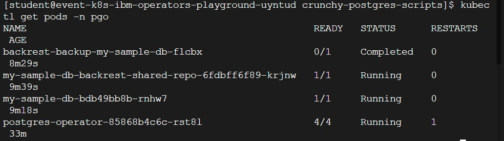

### Create database

For user to create PostgreSQL database Cluster using Crunchy PostgreSQL DB Operator:
```execute
cd /home/student/projects/crunchy-postgres-scripts
```

Create a PostgreSQL DB Cluster:
```execute
kubectl apply -f pgcluster.yaml
```

```execute
kubectl get pods -n pgo
```




NOTE: Please wait till all pods are up and in running state. As shown above.

### Setup connectivity to the DB

Create DB Service:
```execute
echo "apiVersion: v1
kind: Service
metadata:
  labels:
    name: my-sample-db
    pg-cluster: my-sample-db
    vendor: crunchydata
  name: my-sample-db
  namespace: pgo
spec:
  ports:
  - name: sshd
    nodePort: 30088
    port: 2022
    protocol: TCP
    targetPort: 2022
  - name: postgres
    nodePort: 30445
    port: 5432
    protocol: TCP
    targetPort: 5432
  selector:
    pg-cluster: my-sample-db
    role: master
  sessionAffinity: None
  type: NodePort" | kubectl apply -n pgo -f -
```

Check the service:
```execute
kubectl get svc -n pgo | grep "my-sample-db"
```
Get the Cluster IP:
```execute
export ip_addr=$(ifconfig eth1 | grep inet | awk '{print $2}' | cut -f2 -d:)
```

Check the Cluster IP Address:
```execute
echo $ip_addr
```
### Connect to DB from the cluster

```execute
export PGPASSWORD=$(kubectl get secret my-sample-db-postgres-secret -n pgo -o=jsonpath='{.data.password}' | base64 --decode)
echo $PGPASSWORD
psql -U postgres -h $ip_addr -p 30445 my-sample-db
```

### Create TABLE

The PostgreSQL CREATE TABLE statement is used to create a new table in any of the given database:
```execute
CREATE TABLE COMPANY(
   ID INT PRIMARY KEY     NOT NULL,
   NAME           TEXT    NOT NULL,
   AGE            INT     NOT NULL,
   ADDRESS        CHAR(50),
   SALARY         REAL,
   JOIN_DATE	  DATE
);
```

You can verify if your table has been created successfully using \dt command, which will be used to list down all the tables in an attached database:
```execute
\dt 
```

### Insert Values to Table

The PostgreSQL INSERT INTO statement allows one to insert new rows into a table. One can insert a single row at a time or several rows as a result of a query.

The following example inserts a row into the COMPANY table:
```execute
INSERT INTO COMPANY (ID,NAME,AGE,ADDRESS,SALARY,JOIN_DATE) VALUES (1, 'Paul', 32, 'California', 20000.00,'2001-07-13');
```

The following example is to insert a row; here salary column is omitted and therefore it will have the default value:
```execute
INSERT INTO COMPANY (ID,NAME,AGE,ADDRESS,JOIN_DATE) VALUES (2, 'Allen', 25, 'Texas', '2007-12-13');
```

The following example uses the DEFAULT clause for the JOIN_DATE column rather than specifying a value:
```execute
INSERT INTO COMPANY (ID,NAME,AGE,ADDRESS,SALARY,JOIN_DATE) VALUES (3, 'Teddy', 23, 'Norway', 20000.00, DEFAULT );
```

The following example inserts multiple rows using the multirow VALUES syntax:
```execute
INSERT INTO COMPANY (ID,NAME,AGE,ADDRESS,SALARY,JOIN_DATE) VALUES (4, 'Mark', 25, 'Rich-Mond ', 65000.00, '2007-12-13' ), (5, 'David', 27, 'Texas', 85000.00, '2007-12-13');
```

All the above statements would create the following records in COMPANY table. The next chapter will teach you how to display all these records from a table.

### Fetch the Data from the Table

PostgreSQL SELECT statement is used to fetch the data from a database table, which returns data in the form of result table. These result tables are called result-sets.

Fetch all the records from the created table:
```execute
SELECT * FROM company;
```

### To Exit from the DB

```execute
\q
```

### Run a command remotely

1. Run a SELECT command:
```execute
psql -U postgres -h $ip_addr -p 30445 my-sample-db -c "select * from company;"
```

2. Run an INSERT command:
```execute
psql -U postgres -h $ip_addr -p 30445 my-sample-db -c "INSERT INTO COMPANY (ID,NAME,AGE,ADDRESS,JOIN_DATE) VALUES (6, 'Tim', 28, 'Texas', '2009-12-13');"
```
