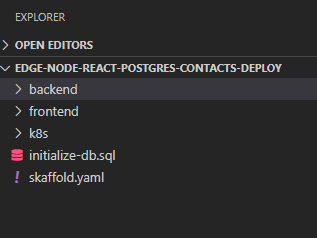

### PostgreSQL DB Example Application: Contacts Application (React/Node.js/PostgreSQL)

***Introduction***

Contacts application comprises of a Crunchy Data PostgreSQL database, backend and frontend which are deployed independently as a microservice.
The example also uses Skaffold which handles the workflow for building, pushing and deploying your application, allowing you to focus on what matters most: writing code.

***Code Structure***



It follows a simple modular and MVC pattern. There are 3 folders that are of our interest:
- k8s:  This contains all the deployment and service yaml for the application. This defines the deployment and exposure of our application.
- frontend: This contains the frontend code built using React.
- backend: This contains all the backend code that is built using Express (Node.js).

### Try the example

Get the Example :

```execute
cd /home/student/projects && git clone https://github.com/operator-playground-io/crunchy-postgres-sample.git
```

For user to create PostgreSQL Database Cluster using Crunchy PostgreSQL DB Operator:
```execute
cd /home/student/projects/crunchy-postgres-sample/k8s
```

Create a contacts PostgreSQL DB Cluster:
```execute
kubectl apply -f contacts-pgcluster.yaml
```

```execute
kubectl get pods -n pgo
```


NOTE: Please wait till all pods are up and in running state. As shown above.

Get the Cluster IP:
```execute
export ip_addr=$(ifconfig eth1 | grep inet | awk '{print $2}' | cut -f2 -d:)
```

Setup the Backend API for deployment:
```execute
cd crunchy-postgres-sample/frontend && export backend_port=30456 && sed -i "s|ip|$ip_addr|" .env && sed -i "s|port|$backend_port|" .env
```

Create the Contacts DB PostgreSQL Service:
```execute
cd /home/student/projects/crunchy-postgres-sample/k8s && kubectl create -f contacts-service.yaml
```

Check if the Contacts DB is up and running:
```execute
nc -z -v -w30 $ip_addr 30435
```

Navigate to the example:
```execute
cd /home/student/projects/crunchy-postgres-sample
```

Create the Contacts DB PostgreSQL Cluster with username and password and initialize the DB:
```execute
PGPASSWORD=password psql -U pguser -h $ip_addr -p 30435 contacts < initialize-db.sql 2>output.txt
```

Setup skaffold default repository to the local one:
```execute
skaffold config set default-repo localhost:5000
```

Install and start the sample. To stop and remove the application you will need to follow the steps from **Clean up the Kubernetes resources**.
```execute
skaffold run
```
Alternatively you can use this command to install the sample, watch for code changes and re-deploy the application automatically.
On exiting the command, Skaffold will automatically stop and delete the sample application. 
```execute
skaffold dev
```

### Access the example application

Click on the Key icon on the dashboard and copy the value under the `DNS` section and `IP` field

URL :  http://##DNS.ip##:30465

### To Deploy changes to Kubernetes in Dev Mode

In this example , we use `Skaffold` which simplifies local development. You can deploy the application in DEV mode which keeps watching for the files changes and on any change, triggers the entire deployment process automatically without the user having to run and manage it manually.

Navigate to the example:
```execute
cd /home/student/projects/crunchy-postgres-sample
```

Deploy the changes in dev mode:
```execute
skaffold dev
```

On exiting the command, Skaffold will automatically destroy all the resources it created with above command.

Also, you can use the `skaffold run` to deploy the changes onto Kubernetes as a normal mode. In this mode, the resources created remains unless the user deletes them.

### Clean up the Kubernetes resources (Example application and PostgreSQL DB)

You can delete all the application resources created by executing the following command:
```execute
skaffold delete
```

To delete the PostgreSQL DB , execute the below commands:

```execute
cd /home/student/projects/crunchy-postgres-scripts
export PGO_OPERATOR_NAMESPACE=pgo
export PGO_NAMESPACE=pgo
```

```execute
kubectl delete -f contacts-pgcluster.yaml
```

```execute
kubectl delete -f "postgresql.yaml"
```
